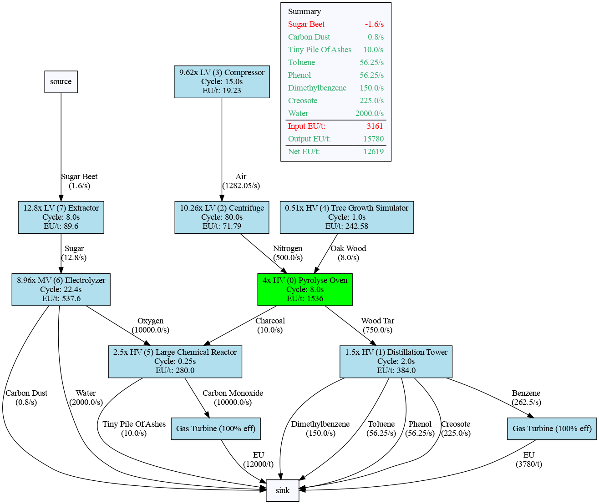
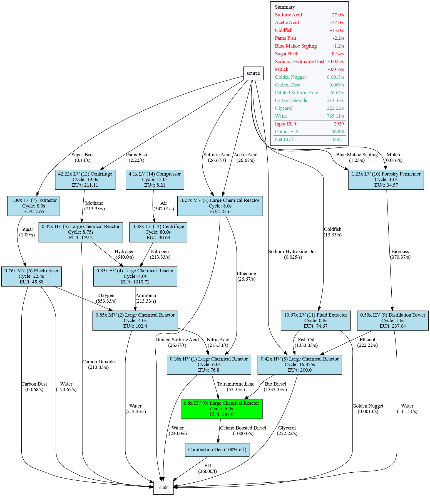

# gtnh-flow

## What is it?

A (beta) tool designed for complex GT packs. In specific, aims to achieve:

1. Quick comparisons of power lines - which ones are "better" in terms of build difficulty, output, I/O efficiency, etc.
2. Showing complex processing lines clearly all in one diagram (eg platline, petrochem, rare earths, etc)
3. An easy standard tool for making balancing decisions
4. Quickly prototyping weird ideas or swapping out different parts in a complex machine line

## Samples

## How do I use it?

1. Clone repository
2. Download Python and dependencies (pip install -r requirements.txt)
3. Create a project file under `projects/`. I have some existing projects here for examples of how one should be structured. In `flow`'s current form, you need to specify exact I/O and eut/duration in ticks, as well as which voltage you wish to actually run the machine at (for calculating overclocks). In addition, at least one machine will need a `number` argument to be specified, which tells the program how to balance the rest of the machines in the network. (The green nodes in the example above are the `number`ed nodes.)
4. Run the project by name using `python3 factory_graph.py myProjectName`. Replace myProjectName with whatever your project is called.
5. Output graph will pop up and also be available in `output/`!

## It's still beta
`gtnh-flow` currently struggles with extremely complex multi-input, multi-output scenarios like advanced petrochem and DT stuff. This is under active development, but for now don't trust multi I/O situations. This specfically means a machine is getting input from multiple sources, or has to spread its output to multiple machines. If the machine graph does not have these, you can make arbitarily large setups and it will be handled correctly.

Also, the number by the machines in parentheses (eg `(5)`) is a debug value and will be removed in the final release.