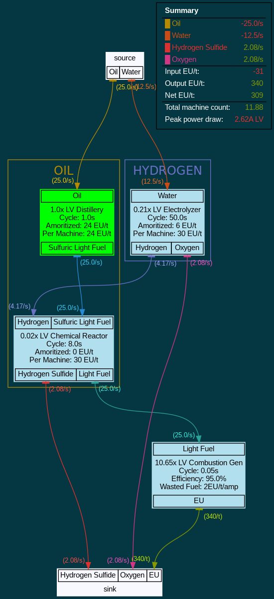
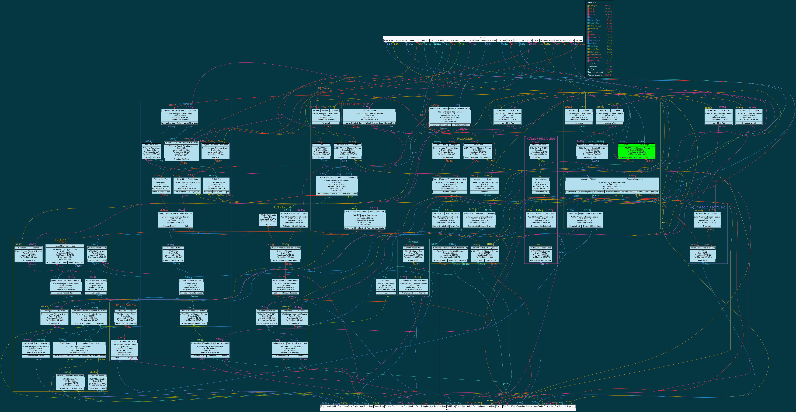
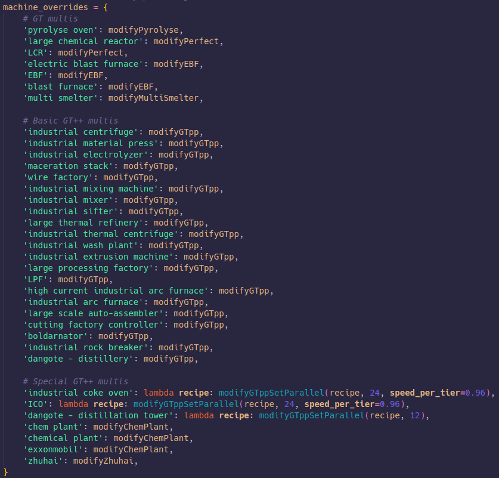

# gtnh-flow

## What is it?

A (beta) tool designed for complex GT packs. In specific, aims to achieve:

1. Quick comparisons of power lines - which ones are "better" in terms of build difficulty, output, I/O efficiency, etc.
2. Showing complex processing lines clearly all in one diagram (eg platline, petrochem, rare earths, etc)
3. An easy standard tool for making balancing decisions
4. Quickly prototyping weird ideas or swapping out different parts in a complex machine line

## Samples

## Installation

#### Linux

1. Clone repository (`git clone https://github.com/OrderedSet86/gtnh-flow.git`)
2. Download Python and dependencies (`pip install -r requirements.txt`)
3. Graphviz is an external library and will need to be downloaded separately (on Debian-based Linux this is `sudo apt-get install graphviz`)
3. Create a project file under `projects/`. You can look at existing projects to see how to structure it. In `flow`'s current form, you need to specify exact I/O and eut/duration in ticks, as well as which voltage you wish to actually run the machine at (for calculating overclocks). In addition, at least one machine will need a `number` or `target` argument to be specified, which tells the program how to balance the rest of the machines in the network. (The green nodes in the example above are the `number`ed nodes.)
4. Run the project by name using `python3 factory_graph.py myProjectName`. Replace myProjectName with whatever your project is called.
5. Output graph will pop up and also be available in `output/`!

#### Windows

(The next steps will ask you to run some commands - use Powershell or WSL for this.)
1. Clone repository `git clone https://github.com/OrderedSet86/gtnh-flow.git` or download it using Code (green button) -> Download ZIP on Github, then unzip.
2. Download Python 3 and install from `https://www.python.org/downloads/windows/`. `pip --version` and `python --version` should both return valid version numbers from the command line. Python should be version 3.
3. Navigate to the cloned git repository in a command prompt and install the Python dependencies `pip install -r requirements.txt`
5. Graphviz is an external library and will need to be downloaded separately. The graphviz maintainers have a guide: `https://forum.graphviz.org/t/new-simplified-installation-procedure-on-windows/224`. It is important that Graphviz is added to the System PATH for either all users or current users and you may need to restart Windows for this change to take effect.
6. Create a project file under `projects/`. You can look at existing projects to see how to structure it. In `flow`'s current form, you need to specify exact I/O and eut/duration in ticks, as well as which voltage you wish to actually run the machine at (for calculating overclocks). In addition, at least one machine will need a `number` or `target` argument to be specified, which tells the program how to balance the rest of the machines in the network. (The green nodes in the example above are the `number`ed nodes.)
7. Run the project by name using `python factory_graph.py myProjectName`. Replace myProjectName with whatever your project is called.
8. Output graph will pop up and also be available in `output/`!

## How do I use it?
Some tips:
+ You can modify a variety of layout and functional choices in `config_factory_graph.yaml`.
+ The POWER_LINE feature in `config_factory_graph` lets you automatically burn fuels and choose which ones to ignore. This is on by default.
+ When writing a config file, I recommend copy pasting an old machine, then editing the numbers. This will help you avoid missing any required fields (eg. EU/t).
+ How to add machines without any power usage? Set "tier" to LV and "eut" to 0.
+ Will this automagically handle overclocking for GT++ multis? Yes! All these names are recognized and will be overclocked automatically to 1A of the tier you select. Specifying the exact amount of power input is a planned feature, but not in the library yet.

+ Sometimes the balancing algorithm will fail. This is explained in more detail in ## It's still beta. You may need to manually make adjustments to some shared ingredients to separate them from other machines. The easiest way to do this is is by renaming the ingredient slightly, like `chlorine 1` and `chlorine 2`. This will cause it to no longer automatically be used in any machine that needs chlorine, just the one you want. You can see this technique used regularly for platline.

## It's still beta
`gtnh-flow` currently struggles with extremely complex multi-input, multi-output scenarios like advanced petrochem and DT stuff. This is under active development, but for now don't trust multi I/O situations. This specfically means a machine is getting input from multiple sources, or has to spread its output to multiple machines. If the machine graph does not have these, you can make arbitarily large setups and it will be handled correctly.
